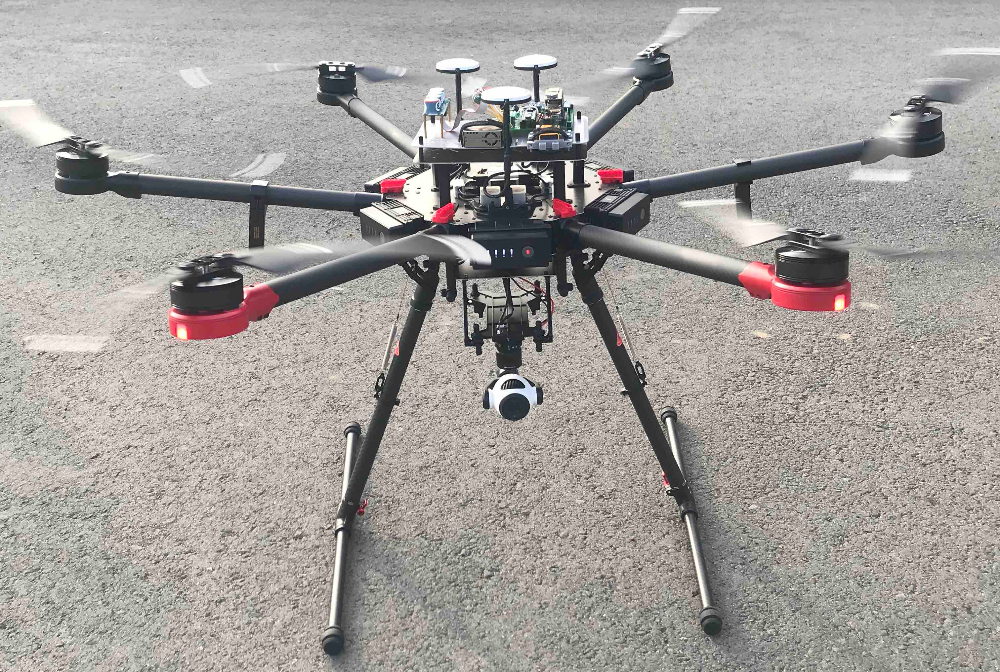

# AQ-drone

The AQ-drone project is an open source air quality measuring system utilizing drone technology to conduct air quality metrics.  This project is inspired by the [JPL Open Source Rover Project](https://github.com/nasa-jpl/open-source-rover).

The goals of this projects are two fold:

1. To develop a pedagogical curriculum from which students can apply engineering and science skills to a real problem

2. To aggregate data from a distributed network of air quality sensors with the ultimate goal of understanding and improving environment impact of polution on the community

## About AQ-drone

## Project Team

### Principal Investigator

John J. Tran

### Development Team

Kevin Benavente, Steven Conaway, Michael Murray, and Jacqueline Curiel.

